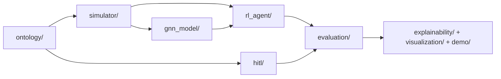

<div align="center">
  
# 🦅 FALCON : Force-multiplying Adaptive Learning & Cognitive Operation Network

*Ontology-driven combat simulation and decision-support research stack combining simulation, GNN uncertainty modeling, RL training, HITL controls, and evaluation tooling.*


[](https://python.org)
[](https://pytorch.org)
[](LICENSE)
[](.)
[](ontology/combat_schema.py)
[](https://github.com)

#### Core Values : *“We do not increase the number of troops. Instead, we redesign the probabilities of the battlefield.”*

</div>

## 📒 TL;DR / Executive Summary

FALCON is an end-to-end experimentation repository for military-domain AI research workflows:

- **Knowledge modeling:** ontology-backed scenario and doctrine representation (`ontology/`).
- **Environment dynamics:** combat engines with fog-of-war, maneuver, and resource constraints (`simulator/`).
- **Learning stack:** Bayesian/temporal GNN components and multiple RL paradigms (`gnn_model/`, `rl_agent/`).
- **Decision governance:** ROE, constraints, preference modeling, and HITL intervention (`hitl/`, `ontology/roe_ethics.py`).
- **Evaluation and reporting:** Monte Carlo, benchmark hooks, metrics, demo artifacts, and test coverage (`evaluation/`, `demo/`, `tests/`).

This repository is structured for **research-to-prototype iteration** rather than a single model benchmark.

## 📌 Highlights / At a Glance

| Area | What is present in this repository |
|---|---|
| Core scripts | `train.py`, `evaluate.py`, `demo.py`, `generate_data.py` |
| Configuration | Phase/evaluation/scenario YAMLs under `configs/` |
| Models/agents | Bayesian GNN, PPO variants, MAPPO/MAT/NFSP/PSRO modules |
| Human oversight | Constraint parsing, preference learning, Pareto/reranking modules |
| Evaluation outputs | JSON/CSV summaries, plots, AAR HTML (demo path) |
| Reproducibility | Seeded CLI flows, pytest suite, GitHub Actions CI |

## 🎯 Why this repository matters

Many repositories focus on isolated algorithm performance. FALCON instead keeps **scenario modeling, simulation realism, agent training, decision constraints, and evaluation artifacts** in one codebase. That organization is useful for:

1. testing ideas across full pipelines,
2. comparing algorithmic variants under common simulation assumptions,
3. producing inspectable artifacts suitable for review and iteration.

## 🏗️ System architecture / core modules



### Module responsibilities

- **`ontology/`**: combat schema, doctrine encoding, multidomain links, scenario presets/loaders, ROE/ethics.
- **`simulator/`**: Lanchester and mixed combat engines, maneuver/fog/weather/cyber/resource effects.
- **`gnn_model/`**: Bayesian HGT, temporal GNN, uncertainty decomposition and calibration.
- **`rl_agent/`**: blue/red agents, self-play, RARL, MAPPO, MAT, NFSP, PSRO, league training utilities.
- **`hitl/`**: constraints, preference learning/adaptation, Pareto candidate generation, replanning.
- **`evaluation/`**: Monte Carlo evaluation, benchmark adapters, metric helpers.
- **`explainability/` + `visualization/`**: AAR/counterfactual/attention and runtime dashboard support.
- **`demo/`**: compact runnable pipeline and lightweight evaluation/reporting path.

## 🧠 Key capabilities

### Implemented (verified from code layout and scripts)

- Ontology-based scenario creation and schema abstractions.
- Multi-engine simulation with fog-of-war and dynamics extensions.
- Phase-oriented training entrypoint (`--phase` in `train.py`) with optional algorithm comparison in phase 2.
- Two evaluation surfaces:
  - root-level evaluator (`evaluate.py`),
  - demo evaluation suites (`python -m demo.evaluate`).
- Data generation pipeline producing scenario/episode/IRL summary datasets.
- Artifact-producing demo flow (`summary.json`, `metrics.csv`, `fig_episode.png`, `aar.html`).
- Automated tests and CI lint/test workflow.

### Research-oriented but maturity varies

Some modules are clearly prototyping-oriented (large single-file trainers, mixed Korean/English comments, evolving packaging conventions). Treat the repository as a **serious experimental platform**, not a finalized product package.

## 📁 Repository structure

```text
falcon/
├── README.md
├── README_KOR.md
├── CONTRIBUTING.md
├── train.py
├── evaluate.py
├── demo.py
├── generate_data.py
├── requirements.txt
├── requirements-dev.txt
├── pyproject.toml
├── setup.py
├── configs/
│   ├── default.yaml
│   ├── phase1.yaml
│   ├── phase2.yaml
│   ├── phase3.yaml
│   ├── evaluation.yaml
│   └── scenarios/*.yaml
├── ontology/
├── simulator/
├── gnn_model/
├── rl_agent/
├── hitl/
├── evaluation/
├── explainability/
├── visualization/
├── demo/
├── tests/
├── docs/
└── .github/workflows/ci.yml
```

## ⚙️ Installation

### 1) Clone and create a virtual environment

```bash
git clone https://github.com/Navy10021/falcon
cd falcon
python -m venv .venv
source .venv/bin/activate
```

### 2) Install dependencies

```bash
pip install --upgrade pip
pip install -r requirements.txt
```

### 3) Optional development dependencies

```bash
pip install -r requirements-dev.txt
```

## 🛠️ Quick Start

> 🔰 **New to FALCON?**  
> For a structured, step-by-step walkthrough of the full pipeline,  
> start with 👉 `notebook/FALCON.ipynb`.
>
> The notebook demonstrates the complete end-to-end workflow —  
> from data generation and phased training to evaluation —  
> with explanations and visualizations.

---

### 🚀 Root demo (Fastest Way to Run)

```bash
python demo.py --seed 42
```

### 📦 Package-style demo pipeline

```bash
python -m demo.demo --scenario urban_defense --seed 42 --policy rule --out runs/demo_urban
```

### ⚡ Fast evaluation
If you just want to quickly validate model behavior:
```bash
python evaluate.py --fast
python -m demo.evaluate --suite small --mc 20 --seed 42 --out outputs/eval_small
```

## ✅ End-to-end workflow
📌 After reviewing the notebook, you can reproduce the full experimental pipeline via CLI:
```bash
# 1) Generate data artifacts
python generate_data.py --quick

# 2) Train by phase
python train.py --phase 1 --config configs/phase1.yaml
python train.py --phase 2 --config configs/phase2.yaml
python train.py --phase 3 --hitl --config configs/phase3.yaml

# 3) Evaluate
python evaluate.py --monte-carlo 200 --fog-level moderate --output-json runs/eval_report.json

# 4) Optional demo suite eval
python -m demo.evaluate --suite standard --mc 100 --seed 0 --out outputs/eval_standard
```

## ⚙️Configuration

- Core defaults: `configs/default.yaml`
- Phase defaults: `configs/phase1.yaml`, `configs/phase2.yaml`, `configs/phase3.yaml`
- Evaluation defaults: `configs/evaluation.yaml`
- Scenario presets: `configs/scenarios/*.yaml`

`train.py` supports `--config` plus CLI overrides for key hyperparameters (episodes, lr, seed, intervals, algorithm mode, etc.).

## 📊 Evaluation / metrics

### Root evaluator (`evaluate.py`)

Key options include:

- `--monte-carlo`, `--workers`, `--max-steps`
- `--fog-level {clear,moderate,maximum}`
- `--fast` / `--full`
- `--benchmark historical` with `--benchmark-runs`
- `--output-json <path>`

### Demo evaluator (`demo.evaluate`)

- Suites: `small`, `standard`, `stress`
- Outputs:
  - `leaderboard.csv`
  - `metrics_aggregate.json`

### Metric helpers

`evaluation/metrics.py` contains reusable functions for force reduction, exchange ratio, mission efficiency, and trend-style summaries.

## 🔬 Explainability / HITL / ontology components

- **Explainability (`explainability/`)**: attention visualization, counterfactual tools, AAR helpers.
- **HITL (`hitl/`)**: constraint parser, preference learner/adapters, Pareto generators, replanning tools.
- **Ontology (`ontology/`)**: combat schema, doctrine and multidomain structures, scenario presets/loaders, ROE/ethics validators.

These modules support policy outputs that can be constrained, interpreted, and reviewed rather than used as opaque model scores.

## 🧪 Example outputs or expected artifacts

### `python -m demo.demo ...`

- `summary.json`
- `metrics.csv`
- `fig_episode.png`
- `aar.html`

### `python -m demo.evaluate ...`

- `leaderboard.csv`
- `metrics_aggregate.json`

### `python generate_data.py ...`

- `data/scenarios.json`
- `data/episodes.json`
- `data/irl_demos_summary.json`
- `data/data_stats.json`
- `data/ontology_stats.html`

## Development & testing

```bash
ruff check .
black --check .
pytest -q
```

Helper scripts:

```bash
bash scripts/format.sh
bash scripts/test.sh
```

CI is defined in `.github/workflows/ci.yml` and runs lint + tests on push/PR.

## Documentation

- **English primary README:** `README.md` (this file).
- **Korean README:** `README_KOR.md` (Korean-language project narrative and deeper context).
- **Contributing guide:** `CONTRIBUTING.md`.
- **Demo-specific guide:** `demo/DEMO_README.md`.
- **Structure policy:** `docs/PROJECT_STRUCTURE.md`.
- **Additional reports:** `docs/report/`, `docs/reports/`, `docs/proposal_assets/`.

## 🤝 Contributing

Please follow `CONTRIBUTING.md` for contribution expectations, test discipline, and PR workflow.

Practical high-impact contribution areas:

- simulation fidelity and calibration,
- RL algorithm stability and benchmarking,
- HITL policy and constraint design,
- test coverage and experiment reproducibility,
- documentation cleanup and packaging consistency.

## 🗺️ Roadmap

### Implemented baseline

- End-to-end scripts for training/evaluation/demo/data generation.
- Modular domains for ontology, simulation, GNN, RL, HITL, evaluation, explainability.
- Multi-layer test suite and CI integration.

### Near-term improvements (inferred from current structure/docs)

- Package naming consistency (root scripts vs package-style invocation patterns).
- More explicit experiment cards (seed grids, config snapshots, artifact schema standards).
- Additional baseline comparators and standardized benchmark tables.
- Continued refactoring of large training/evaluation files into smaller modules.

## ⚖️ License

This project is licensed under the MIT License. See the `LICENSE` file for details.

---

## 🛡️ Responsible Use Notice

FALCON is developed as a research and simulation framework for
AI-driven decision support and force optimization modeling.

It is **NOT intended for operational deployment in real-world combat,
offensive military action, or targeting of specific entities**.

Any use of this repository should comply with:

- International humanitarian law
- AI ethics and safety standards
- Responsible research and innovation principles

The authors disclaim responsibility for misuse or unlawful application.
