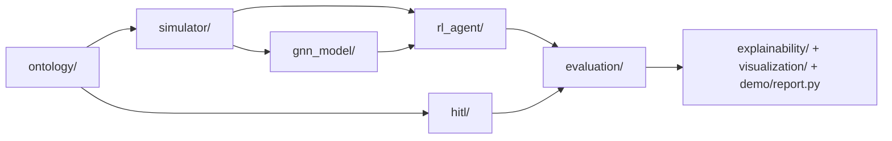

# FALCON (Force-Adaptive Learning for Combat Optimization Network)

*A modular research repository for ontology-driven combat simulation, uncertainty-aware graph modeling, adversarial RL, and human-in-the-loop decision support.*

## Badge suggestions

> Suggested badges (replace links/usernames as needed):

- `CI` (GitHub Actions): `.github/workflows/ci.yml`
- `Python` version compatibility (from `setup.py` / CI)
- `License: MIT` (from `LICENSE`)
- `Tests` status (pytest in CI)

Example markdown:

```md
[](https://github.com/Navy10021/falcon/actions/workflows/ci.yml)
[](https://www.python.org)
[](LICENSE)
```

## TL;DR

- **What this is:** a Python research stack that combines ontology modules, simulation engines, GNN uncertainty modeling, RL agents, HITL components, and evaluation tooling.
- **How to run quickly:** install dependencies, run `python demo.py` or `python -m demo.demo ...`, then evaluate via `python evaluate.py --fast`.
- **Why it is useful:** the repository includes not just model code, but also scenario generation, reporting artifacts, tests, and CI for reproducible experimentation.

## Why this repository matters

FALCON is organized as an **end-to-end experimentation environment**, not a single algorithm repository. It includes:

- domain modeling (`ontology/`),
- environment dynamics (`simulator/`),
- learning components (`gnn_model/`, `rl_agent/`),
- decision constraints and preference components (`hitl/`),
- evaluation and benchmark utilities (`evaluation/`, `demo/evaluation/`),
- reporting and explainability helpers (`explainability/`, `demo/report.py`),
- regression tests and CI (`tests/`, `.github/workflows/ci.yml`).

This structure makes it suitable for teams that need to iterate across modeling, training, evaluation, and reporting in one codebase.

## System architecture / core modules



### Core module roles

- **`ontology/`**: combat schema, doctrine encoding, scenario presets/loading, ROE/ethics checks, temporal/intelligence extensions.
- **`simulator/`**: lanchester engines, mixed combat dynamics, maneuver, fog-of-war, missile/weather/resource/cyber effects.
- **`gnn_model/`**: Bayesian/temporal graph components, uncertainty helpers, calibration utilities.
- **`rl_agent/`**: blue/red agents, self-play trainer, robust/adversarial and multi-agent variants (e.g., RARL, league self-play, MAPPO/MAT/NFSP modules).
- **`hitl/`**: constraint parsing, preference learning, Pareto candidate generation, reward adaptation, replanning.
- **`evaluation/`**: Monte Carlo evaluation, adversarial/historical benchmark helpers, metric utilities.
- **`demo/`**: lightweight runnable pipeline with fixed artifacts and compact evaluation suites.
- **`tests/`**: CLI contract checks, numerical stability, phase/tier regression tests.

## Key capabilities

Implemented capabilities in the current repository include:

1. **Ontology-backed scenario construction** through `ScenarioFactory` and related schema utilities.
2. **Fog-of-war and uncertainty-aware modeling** in simulator + GNN components.
3. **Multiple RL training routes** (phase-oriented training, self-play path, optional MAPPO path in phase 2).
4. **HITL-oriented strategy filtering/re-ranking** via constraints and Pareto candidate generation.
5. **Two evaluation paths**:
   - main evaluator (`evaluate.py`) with Monte Carlo and optional historical benchmark mode,
   - demo evaluator (`python -m demo.evaluate`) that emits leaderboard and aggregate metrics.
6. **Artifact-oriented demo outputs** (`summary.json`, `metrics.csv`, `fig_episode.png`, `aar.html`).

## Repository structure

```text
falcon/
├── README.md
├── README_KOR.md
├── CONTRIBUTING.md
├── train.py
├── evaluate.py
├── demo.py
├── generate_data.py
├── requirements.txt
├── requirements-dev.txt
├── pyproject.toml
├── setup.py
├── configs/
│   ├── default.yaml
│   ├── phase1.yaml
│   ├── phase2.yaml
│   ├── phase3.yaml
│   ├── evaluation.yaml
│   └── scenarios/
├── ontology/
├── simulator/
├── gnn_model/
├── rl_agent/
├── hitl/
├── evaluation/
├── explainability/
├── visualization/
├── demo/
├── tests/
├── docs/
└── .github/workflows/ci.yml
```

## Installation

### 1) Clone and create environment

```bash
git clone https://github.com/Navy10021/falcon
cd falcon
python -m venv .venv
source .venv/bin/activate
```

### 2) Install runtime dependencies

```bash
pip install -r requirements.txt
```

### 3) (Optional) install development tools

```bash
pip install -r requirements-dev.txt
```

## Quick start

### Option A: full root demo

```bash
python demo.py --seed 42
```

### Option B: compact demo module with fixed artifacts

```bash
python -m demo.demo --scenario urban_defense --seed 42 --policy rule --out runs/demo_urban
```

### Quick evaluation

```bash
python evaluate.py --fast
python -m demo.evaluate --suite small --mc 20 --seed 42 --out outputs/eval_small
```

## End-to-end workflow

A practical workflow supported by the repository:

1. **Generate synthetic datasets** for scenario/episode/IRL summaries:
   ```bash
   python generate_data.py --quick
   ```
2. **Train by phase** (configurable via CLI or YAML):
   ```bash
   python train.py --phase 1 --config configs/phase1.yaml
   python train.py --phase 2 --config configs/phase2.yaml
   python train.py --phase 3 --hitl --config configs/phase3.yaml
   ```
3. **Run evaluation**:
   ```bash
   python evaluate.py --monte-carlo 200 --fog-level moderate --output-json runs/eval_report.json
   ```
4. **Review artifacts and reports** (`runs/`, `outputs/`, `data/`, and demo AAR HTML).

## Configuration

Configuration is defined in YAML files under `configs/` and can be overridden by CLI arguments.

- `configs/default.yaml`: default training/evaluation values.
- `configs/phase1.yaml`, `phase2.yaml`, `phase3.yaml`: phase-specific training defaults.
- `configs/evaluation.yaml`: evaluation defaults.
- scenario-specific presets under `configs/scenarios/`.

`train.py` supports `--config` and fills unspecified CLI options from YAML.

## Evaluation / metrics

### Main evaluation path (`evaluate.py`)

- Monte Carlo evaluation (`--monte-carlo`, `--workers`, `--fog-level`, `--max-steps`)
- `--fast` and `--full` presets
- optional JSON export via `--output-json`
- optional historical benchmark route via `--benchmark historical`

### Demo evaluation path (`demo.evaluate`)

- suite-based runs (`small`, `standard`, `stress`)
- outputs:
  - `leaderboard.csv`
  - `metrics_aggregate.json`

### Metric utilities

`evaluation/metrics.py` provides reusable metrics (force reduction rate, exchange ratio, mission efficiency, moving averages).

## Explainability / HITL / ontology components

- **Explainability (`explainability/`)**: attention visualization, automatic AAR utilities, counterfactual analysis modules.
- **HITL (`hitl/`)**: preference learner, Pareto strategy generator, natural-language interface and constraint parser.
- **Ontology (`ontology/`)**: schema, doctrine, multidomain structures, ROE/ethics checks, scenario presets/loaders.

These are integrated in both root-level scripts and the `demo/` package workflows.

## Example outputs or expected artifacts

### `python -m demo.demo ...` expected artifacts

- `summary.json`
- `metrics.csv`
- `fig_episode.png`
- `aar.html`

### `python -m demo.evaluate ...` expected artifacts

- `leaderboard.csv`
- `metrics_aggregate.json`

### `python generate_data.py ...` expected artifacts

- `data/scenarios.json`
- `data/episodes.json`
- `data/irl_demos_summary.json`
- `data/data_stats.json`
- `data/ontology_stats.html`

## Development & testing

### Local checks

```bash
ruff check .
black --check .
pytest -q
```

### Helper scripts

```bash
bash scripts/format.sh
bash scripts/test.sh
```

### CI

GitHub Actions workflow (`.github/workflows/ci.yml`) runs lint + tests on push/PR.

## Documentation

- **English README**: this file (`README.md`) should be treated as the primary high-level technical entrypoint.
- **Korean README**: `README_KOR.md` provides a Korean-language project narrative and extended context.
- **Project structure notes**: `docs/PROJECT_STRUCTURE.md`.
- **Demo-focused usage**: `demo/DEMO_README.md`.
- **Additional reports/analysis**: `docs/report/` and `docs/reports/`.

## Contributing

See `CONTRIBUTING.md` for contribution guidance and expectations. Typical contribution areas:

- simulator and environment realism,
- algorithmic improvements in GNN/RL modules,
- evaluation/reporting robustness,
- tests and reproducibility infrastructure.

## Roadmap

### Implemented (verified in repository)

- phase-oriented training/evaluation scripts,
- ontology/simulator/GNN/RL/HITL module layout,
- test suite + CI,
- demo/evaluation artifact pipelines.

### Future work (inferred from current structure/docs)

- stronger packaging consistency and command unification,
- expanded benchmark baselines and standardized experiment cards,
- additional documentation cleanup between English/Korean/readme variants,
- continued hardening of reproducibility metadata across runs.

## License

MIT License. See `LICENSE`.
