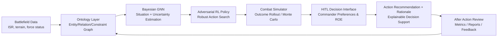

# 🚀 FALCON 

<div align="center">


**Force-Adaptive Learning for Combat Optimization Network**  
**Ontology + Bayesian GNN + Adversarial RL for commander-centered battlefield decision support**

</div>

---

## 1) Proposal Background / Goals

### Idea Name
**FALCON (Force-Adaptive Learning for combat Optimization Network)**  
A knowledge-structured, uncertainty-aware, reinforcement-optimized platform designed to improve multi-domain operational decisions with **minimal force, minimal losses, and maximal mission effect**.

### Core Value — *The FALCON Approach*
> **"From force-centric structures to intelligence-centric structures."**

FALCON is not just automation. It combines:
- **Ontology-based battlefield knowledge structuring**
- **Uncertainty perception via Bayesian GNN**
- **Robust tactical exploration via Adversarial RL**
- **Human-in-the-loop (HITL) command authority**

### Goals
1. Multi-objective optimization: *minimum troops · minimum damage · maximum mission success*
2. Accountable AI operation under commander authority (HITL-first)
3. Phased deployment path: **simulation → training → constrained operation → expansion**

---

## 2) Technical Architecture / Concept Diagram



**Operational concept:** Ontology formalizes context, Bayesian GNN models uncertainty, RL explores resilient actions, and HITL enforces accountable command decisions.

---

## 3) Core Algorithmic Operating Principle

1. **Knowledge Encoding (Ontology):** Converts units, missions, doctrine, constraints, and context into machine-reasonable structures.
2. **Uncertainty-Aware State Estimation (Bayesian GNN):** Predicts risk and confidence under partial observability.
3. **Robust Policy Optimization (Adversarial RL):** Learns tactics resilient to deception, uncertainty, and worst-case interactions.
4. **Constraint-Aware Decision Scoring (HITL + ROE):** Re-ranks candidate actions using commander preferences and ethical/ROE constraints.
5. **Closed-Loop Improvement:** Simulation/evaluation outputs are fed back to improve ontology, policy, and decision quality.

---

## 4) Core Features / Differentiators

- 🧠 **Ontology-native battlefield reasoning** (not flat feature engineering)
- 🌫️ **Uncertainty-aware recommendations** (confidence + risk in the loop)
- ⚔️ **Adversarial robustness** against tactical perturbations
- 👨‍✈️ **Commander-centered control (HITL)** preserving responsibility chain
- 📊 **Evaluation-ready pipeline** with Monte Carlo robustness and benchmark scripts
- 🧾 **Explainability artifacts** for AAR and reproducible analysis

---

## 5) QuickStart

```bash
# 1) Clone
git clone https://github.com/Navy10021/falcon
cd demo

# 2) Install dependencies
python -m venv .venv
source .venv/bin/activate
pip install -r requirements.txt

# 3) Run the full demo pipeline
python demo.py

# 4) Run package demo entrypoint
python -m demo.demo --scenario urban_defense --seed 42 --policy rule --out runs/demo_urban

# 5) Evaluation
python evaluate.py --fast
python -m demo.evaluate --suite small --mc 20 --seed 42 --output-dir runs/eval
```

---

## Project Layout

- `demo/` — package modules for demo/evaluation/reporting/HITL
- `ontology/`, `gnn_model/`, `rl_agent/`, `simulator/` — core research components
- `evaluation/` — Monte Carlo and benchmark utilities
- `tests/` — regression, contract, smoke, and phase tests

---

## Contributing

PRs are welcome for:
- model quality improvements
- robustness/evaluation extensions
- explainability and HITL UX enhancements

Please include reproducible steps and test evidence with every change.

---

## License

This project is released under the MIT License.
